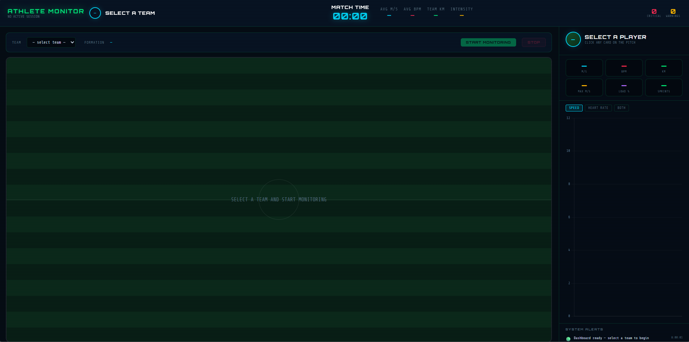
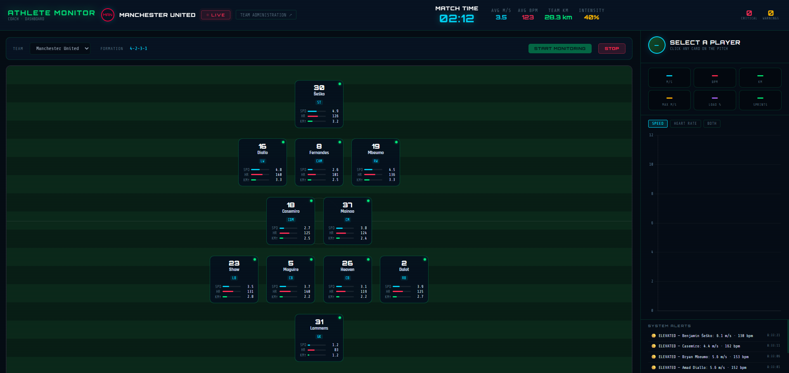
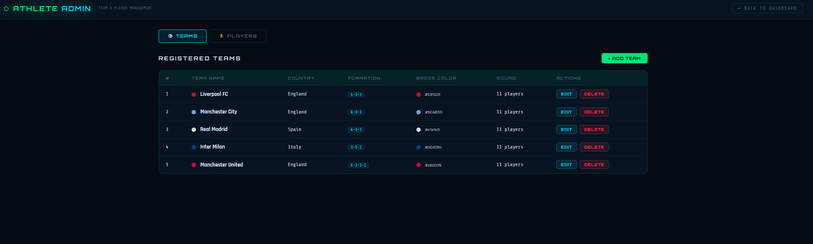
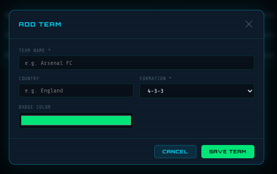
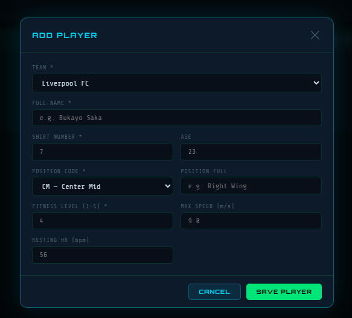
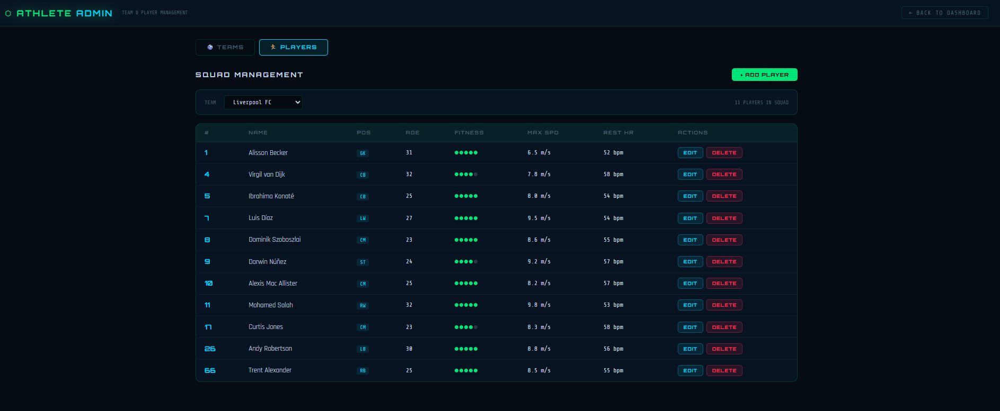
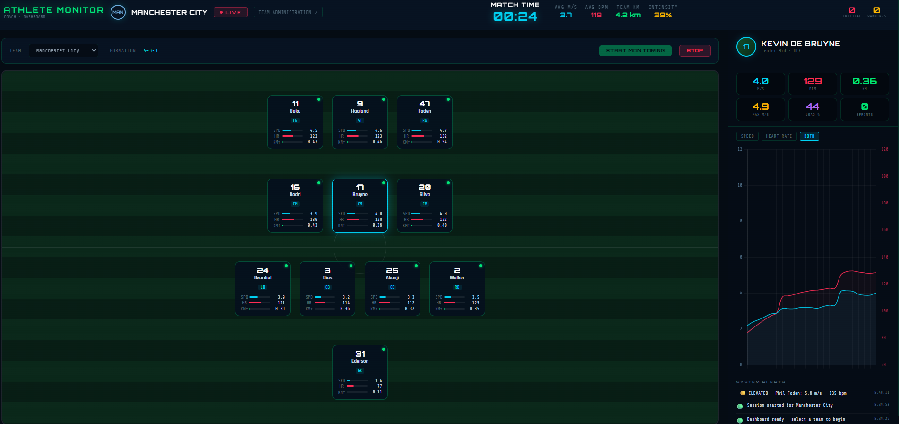

# Athlete Monitor — Real-Time Player Tracking System

**Athlete Monitor** is a real-time, production-grade athlete tracking system that simulates and visualizes physiological data from up to 11 football players simultaneously. It provides sports scientists, coaches, and medical staff with instant visibility into player fatigue, injury risk, and performance metrics during training sessions or live matches.
**Built with Java 17, Spring Boot 3.2, Apache Kafka, and WebSocket.**

---
### What it is and how does it work entirely
>A real-time web application that simulates GPS + heart rate sensors from 11 football players, streams that data through Apache Kafka, processes it in Spring Boot, and pushes live updates to a dashboard over WebSocket. Coaches see every player on a pitch-formation view with colour-coded risk levels. Clicking a player opens a live chart showing speed and heart rate over the last 30 seconds.

---
### Tech Stack
| Layer             | Technology                | Purpose                                |
|-------------------|---------------------------|----------------------------------------|
| Language          | Java 17                   | Core logic                             |
| Framework         | Spring Boot 3.2           | Web server, DI, scheduling             |
| Message broker    | Apache Kafka 3.x (Docker) | Decouple simulator from processor      |
| Stream processing | Kafka Streams             | 10-second windowed averages per player |
| Real-time push    | Spring WebSocket + STOMP  | Dashboard updates every second         |
| Frontend          | HTML5 + Chart.js + SockJS | Formation view + live charts           |
| Build             | Maven 3.9                 | Dependency management                  |

---
### Prerequisites
- Java 17+
- Maven 3.9+
- Docker Desktop

---
### Quick Start
```bash
# 1. Start Kafka
docker compose up -d
# 2. Start the app
mvn spring-boot:run
# 3. Open the dashboard
# http://localhost:8080
```

---
### Architecture
```
┌──────────────────────────────┐
│      MetricSimulator         │
│        (@Scheduled)          │
└──────────────┬───────────────┘
               │
               │ JSON → Kafka topic
               │ (player-metrics, ~11 msg/sec)
               ▼
┌──────────────────────────────┐
│        Kafka Broker          │
│         (Docker)             │
└──────────────┬───────────────┘
               │
               │ Kafka Streams
               │ (10s window → avg speed + avg HR)
               ▼
┌──────────────────────────────┐
│   processed-metrics topic    │
└──────────────┬───────────────┘
               │
               │ @KafkaListener
               ▼
┌──────────────────────────────┐
│     PlayerStateService       │
│  (ConcurrentHashMap +        │
│   60-point ring buffer)      │
└───────┬───────────┬──────────┘
        │           │
        │           └──────────────► AlertService
        │                           → /topic/alerts
        │
        │ @Scheduled (every 1s)
        ▼
┌──────────────────────────────┐
│   WebSocketBroadcaster       │
│     → /topic/all-metrics     │
└──────────────┬───────────────┘
               │
               │ SockJS + STOMP
               ▼
┌──────────────────────────────┐
│         Dashboard            │
│ (formation view + Chart.js)  │
└──────────────────────────────┘
```

---
### Project Structure
```
src/main/java/com/vbforge/athletemonitor/
├── config/             --> KafkaConfig, KafkaStreamsConfig, WebSocketConfig
├── model/              --> RawMetric, ProcessedMetric, Alert
├── simulator/          --> MetricSimulator (@Scheduled producer)
├── streams/            --> MetricStreamProcessor (Kafka Streams topology)
├── consumer/           --> ProcessedMetricConsumer (@KafkaListener)
├── service/            --> PlayerStateService, AlertService
├── websocket/          --> WebSocketBroadcaster
└── controller/         --> DashboardController, MetricsRestController
```

---
### API Endpoints
| Method | Path                    | Description                        |
|--------|-------------------------|------------------------------------|
| GET    | /api/players            | Current snapshot of all 11 players |
| GET    | /api/history/{playerId} | Last 60 data points for a player   |

---
### Future Enhancements
- Replace Kafka Streams with Apache Flink for horizontal scaling beyond 50 players
- Add PostgreSQL + TimescaleDB for 30-day historical retention
- JWT authentication for club-restricted access
- Prometheus + Grafana metrics dashboard

---
### Screenshots







